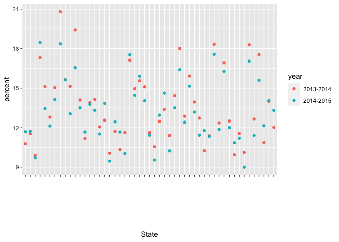

strings\_and\_factors
================

``` r
library(tidyverse)
```

    ## ── Attaching packages ───────────────────────────────────────────────────────────── tidyverse 1.3.0 ──

    ## ✓ ggplot2 3.3.2     ✓ purrr   0.3.4
    ## ✓ tibble  3.0.3     ✓ dplyr   1.0.2
    ## ✓ tidyr   1.1.2     ✓ stringr 1.4.0
    ## ✓ readr   1.4.0     ✓ forcats 0.5.0

    ## ── Conflicts ──────────────────────────────────────────────────────────────── tidyverse_conflicts() ──
    ## x dplyr::filter() masks stats::filter()
    ## x dplyr::lag()    masks stats::lag()

``` r
library(rvest)
```

    ## Loading required package: xml2

    ## 
    ## Attaching package: 'rvest'

    ## The following object is masked from 'package:purrr':
    ## 
    ##     pluck

    ## The following object is masked from 'package:readr':
    ## 
    ##     guess_encoding

``` r
library(httr)
library(p8105.datasets)
library(stringr)
```

## Strings and regex

``` r
string_vec = c("my", "name", "is", "jeff")

str_detect(string_vec, "jeff")
```

    ## [1] FALSE FALSE FALSE  TRUE

``` r
string_vec = c(
  "i think we all rule for participating",
  "i think i have been caught",
  "i think this will be quite fun actually",
  "it will be fun, i think"
  )

str_detect(string_vec, "i think")
```

    ## [1] TRUE TRUE TRUE TRUE

``` r
str_detect(string_vec, "^i think")
```

    ## [1]  TRUE  TRUE  TRUE FALSE

``` r
str_detect(string_vec, "i think$")
```

    ## [1] FALSE FALSE FALSE  TRUE

``` r
string_vec = c(
  "Y'all remember Pres. HW Bush?",
  "I saw a green bush",
  "BBQ and Bushwalking at Molonglo Gorge",
  "BUSH -- LIVE IN CONCERT!!"
  )

str_detect(string_vec, "Bush")
```

    ## [1]  TRUE FALSE  TRUE FALSE

``` r
str_detect(string_vec, "[Bb]ush")
```

    ## [1]  TRUE  TRUE  TRUE FALSE

``` r
string_vec = c(
  '7th inning stretch',
  '1st half soon to begin. Texas won the toss.',
  'she is 5 feet 4 inches tall',
  '3AM - cant sleep :('
  )

str_detect(string_vec, "^[0-9][a-zA-Z]")
```

    ## [1]  TRUE  TRUE FALSE  TRUE

``` r
string_vec = c(
  'Its 7:11 in the evening',
  'want to go to 7-11?',
  'my flight is AA711',
  'NetBios: scanning ip 203.167.114.66'
  )

str_detect(string_vec, "7.11")
```

    ## [1]  TRUE  TRUE FALSE  TRUE

``` r
string_vec = c(
  'The CI is [2, 5]',
  ':-]',
  ':-[',
  'I found the answer on pages [6-7]'
  )

str_detect(string_vec, "\\[")
```

    ## [1]  TRUE FALSE  TRUE  TRUE

## Factors

``` r
factor_vec=factor(c("male", "female", "female", "female"))

factor_vec
```

    ## [1] male   female female female
    ## Levels: female male

``` r
as.numeric(factor_vec)
```

    ## [1] 2 1 1 1

What happens if I relevel…

``` r
factor_vec= fct_relevel(factor_vec, "male")

factor_vec
```

    ## [1] male   female female female
    ## Levels: male female

``` r
as.numeric(factor_vec)
```

    ## [1] 1 2 2 2

\#\#NSDUH

``` r
 url = "http://samhda.s3-us-gov-west-1.amazonaws.com/s3fs-public/field-uploads/2k15StateFiles/NSDUHsaeShortTermCHG2015.htm"

drug_use_html=read_html(url)

table_marj=
drug_use_html %>% 
  html_nodes(css="table") %>% 
  first() %>% 
  html_table() %>% 
  slice(-1) %>% 
  as_tibble()
```

``` r
data_marj=
  table_marj %>% 
  select(-contains("P Value")) %>% 
  pivot_longer(
    -State,
    names_to= "age_year",
    values_to="percent",
  ) %>% 
  separate(age_year, into=c("age", "year"), sep = "\\(") %>% 
  mutate(
    year=str_replace(year, "\\)", ""),
    percent=str_replace(percent, "[a-c]$", ""),
    percent=as.numeric(percent)
  ) %>% 
  filter(!(State %in% c("Total U.S.", "Northeast", "Midwest", "South", "West")))
```

## NSDUH– factors

``` r
data_marj %>% 
  filter(age== "12-17") %>% 
  mutate(State=fct_relevel(State,"Texas", "Oklahoma"))%>% 
  ggplot(aes(State, y=percent, color=year))+
  geom_point()+
  theme(axis.text.x= element_text(angle=90, vjust=90, hjust=1))
```

<!-- -->

``` r
data_marj %>% 
  filter(age== "12-17") %>% 
  mutate(State=fct_reorder(State,percent))%>% 
  ggplot(aes(State, y=percent, color=year))+
  geom_point()+
  theme(axis.text.x= element_text(angle=90, vjust=90, hjust=1))
```

<!-- -->
